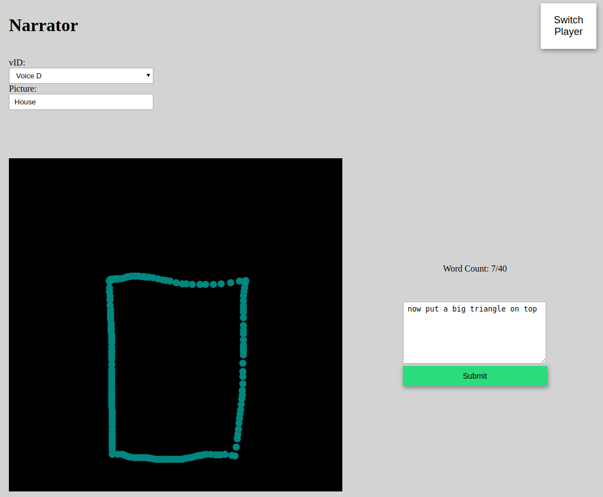
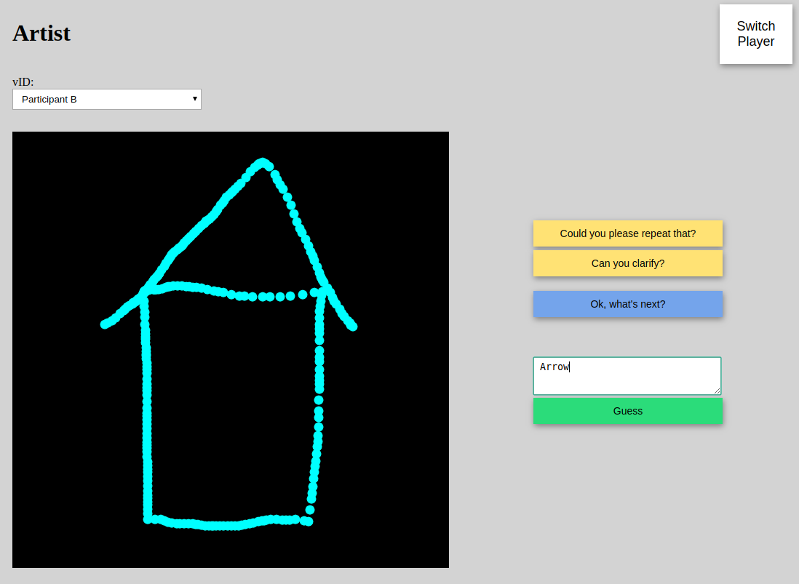
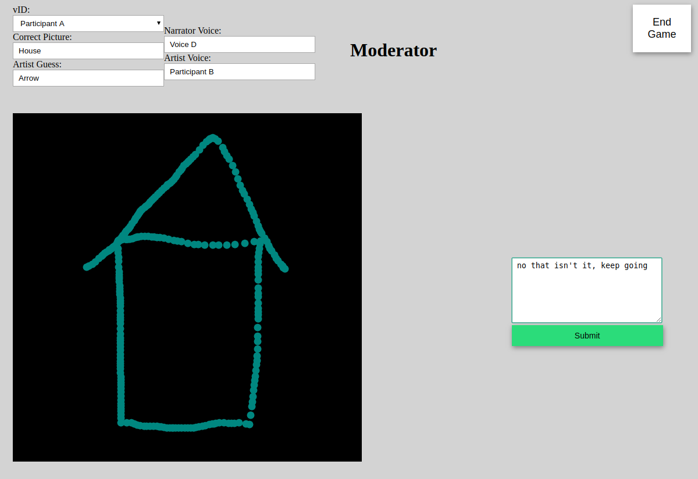
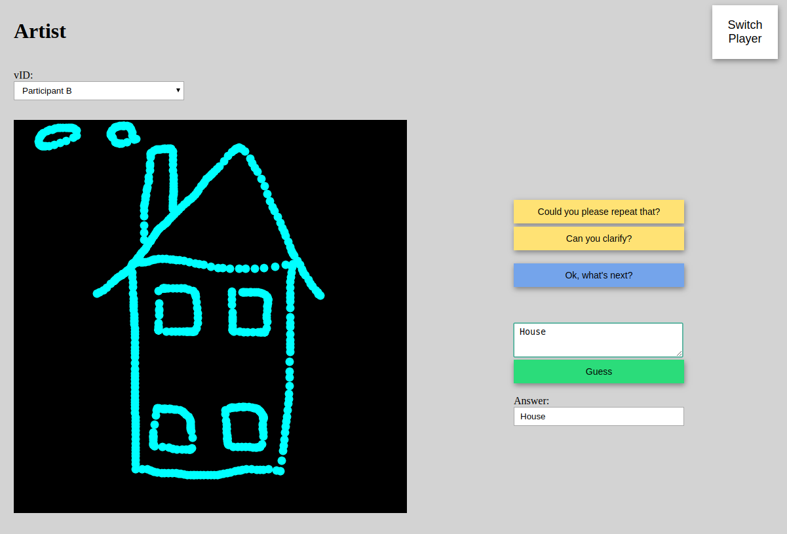
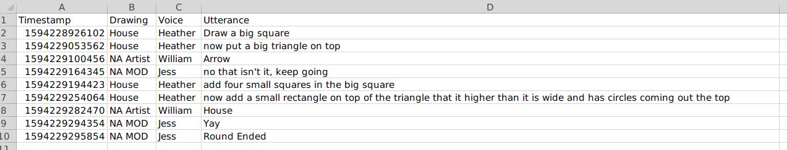

# Drawing Conclusions: A Collaborative Drawing Game
### 👩‍🎨🎨👨‍🎨.

This drawing game has been created for research use so can be hosted locally and you keep all of the data where hosted. If you use this game in your research, please cite... tbc.

Originally created for a collaboration between UCL and Heriot-Watt University's Interaction Lab.

Below you will find a short game guide and then instructions on how to run the game. The code has been commented in detail for reusability.

## Guide:

This game requires three people. Two players and a moderator (likely yourself, running the experiment). These three roles from now on are referred to with the following titles:
* Narrator - the player that chooses the picture to be drawn and describes this drawing to the artist (without using the object name of course).
* Artist - the player that listens to the narrator and draws following their instructions.
* Moderator - the researcher that monitors the game.

The Artist can guess what they are drawing so their correct guess is the aim of the game. In other words, the Narrator wants to help the artist guess what picture the narrator chose by giving clear instructions.

The moderator oversees this and can supervise if necassary. The game ends when the moderator deems the guess to be close enough to the correct answer. The players then switch roles and play continues.

Each player can choose a voice to represent them, this can be controlled if needed and can also be run as a Wizard of Oz experiment.

### Example Game

Let's jump into a game. You can see that each player has chosen there voice and the Narrator is describing a house (very easy example). The narrator has instructed the artist to draw a big square and is now instructing them to "now put a big triangle on top":



The artist does this and then guesses "Arrow":



The moderator sees (and hears) this so informs the players that they should continue. You can also see that the moderator can see the drawing, the voice choices, the target picture and the most recent guess:



A little further into the game, the artist guesses correctly:



The game is ended by the moderator and the players switch roles. This is just a short round as a house is very easy to draw. The data from this round is stored in a csv:



Only the artist's guesses are recorded but they do have a limited number of voice interactions. They can say one of three things:
1. Could you please repeat that?
2. Can you clarify?
3. Ok, What's next?

### Installation and Setup

To run this code the first time:
Make sure you have node and npm installed on your machine.

1. Clone this repository.
2. Open the cloned directory in your terminal.
3. Replace the accountID and password in `config.json` with your Cereproc credentials.
4. Run: ```npm install```
5. Run: ```node server.js```
6. Open Player 1 (Narrator) running at: http://localhost:3000/?id=1
7. Open Player 2 (Artist) running at: http://localhost:3000/?id=2
8. Open Player 3 (Moderator) running at: http://localhost:3000/?id=3

To start the game again just follow steps 2, 5, 6, 7, and 8.

### Voices

Each player chooses their voice at the beginning of each round. These voices are from Cereproc's TTS. The code can be changed to integrate with another TTS of course.

#### Objective

Player 1 is the player that chooses a picture and has to instruct Player 2 how to draw the chosen picture (without saying what is is!!).

Player 2 has to follow Player 1's instructions to draw the picture. Once they think they know what they are drawing, Player 2 has can enter their guess. Guessing ends the round!

#### Steps

Each player first selects their vID (chosen voice ID) in the top-left of their screens. Player 1 also enters what their chosen picture is.

Player one can then instruct Player 2 how to draw their picture (max 40 words at a time).

Player 2 draws and can say one of three things:

1. Could you please repeat that?
2. Can you clarify?
3. Ok, What's next?

Once player 2 thinks they know what they are drawing, they enter and submit their guess. This ends the game. Player 1 will see their guess and Player 2 will see what the correct answer is.

To start a new round, both players can click Switch Player.

Inspired by [Daniel Shiffman ("The Coding Train")](https://www.youtube.com/watch?v=bjULmG8fqc8 "The Coding Train")
